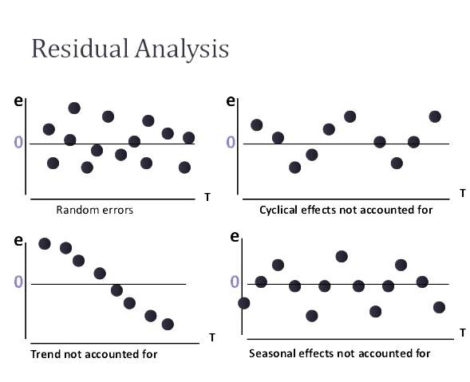
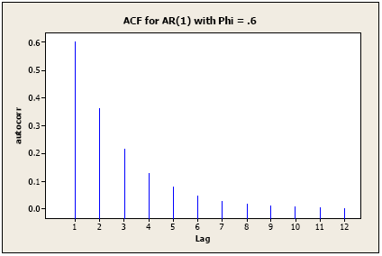
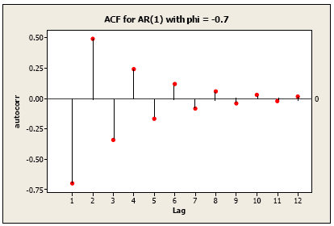
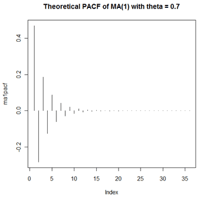
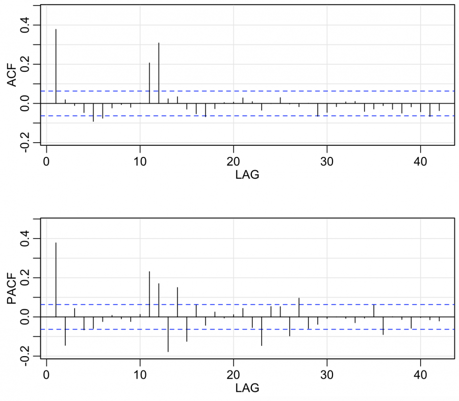

```{r setup, include=FALSE}
knitr::opts_chunk$set(echo = TRUE)
```

## Introduction

This report has the main objective of being a comprehensive, almost practical guide, to time series analysis. Classical methods for modeling univariate time series and forecasting will be discussed and implemented in R, as examples.

This analysis will be divided in the following parts:

* Time Series Basics  
* The AR process  
* The MA process  
* ACF and PACF  
* ARIMA  
     - Model Selection  
     - Forecasting  
* Seasonality and the ARIMA model  

***

## Time Series Basics

> *"A univariate time series is a sequence of measurements of the same variable collected over time.  Most often, the measurements are made at regular time intervals."*

Time series are a very common and important type of data. Examples of time series are the GDP of a country over the years, counts of sunspots, and the daily closing value of the Dow Jones Industrial Average. Time series analysis comprises methods for analyzing time series data in order to extract meaningful statistics and other characteristics of the data. Time series forecasting is the use of a model to predict future values based on previously observed values. 

Very often the main purpose of a time series study is to be able to forecast future values of the series. That has many applications, and is valuable information. It is not always that forecasts will be very accurate, but they are a very good estimation.

Nowadays, the classical models for analysis and forecasting time series are some types of time domain models that make use of past terms of the series and past prediction errors. Those are called ARIMA models (Auto Regressive Moving Average). There are also simpler models such as linear regression models and more complex models that use neural networks and even deep learning to fit and forecast time series data, like LSTM networks. The focus of this report tough, is on explaining the fundamentals of time series analysis using ARIMA models and other similar models, that make use of past terms, or lagged terms as they are very often called, in the form of difference equations, to explain and forecast a time series.


```{r cars,echo=FALSE,fig.align="center"}
plot(USAccDeaths,main = "Time series of the Number of Accidental Deaths in the US 1973-78")
```

When looking at a time series there are some important characteristics that should be taken into account in order to fit a good model for the series. Those play a key role in time series analysis and should be treated or considered during the analysis.

* **Trend** in the data: on average, the measurements tend to increase or decrease over time.
* **Seasonality**: the data has regularly repeating patterns that are related to calander time, such as weeks, months and so on.
* **Cycles**: a period of repeating patterns, unrelated to seasonal factors.
* **Variance**: is the variance constant in the series or are there any periods of increased variance.

A time series to be well modeled by an ARIMA model should have no trend, should have constant variance and suffer no abrupt changes to its behaviour. As far as seasonality or cycles, those should be dealt with by transformations and diferentiation.

To guarantee that the series follows these patterns, transformations to the data may be applied. To guarantee the series has no trend, or equivalently, to guarantee the series is stationary, the first difference of the series should be taken in case the trend is stochastic, meaning it is a random trend, then analysis is done and the series is integrated back to its original state (most models do the differentiation plus integration step automatically). Usually the maximum level of differentiation in a time series is two, over-diferentiation of a time series can lead to sad results. In case the trend is deterministic, meaning it has a behaviour that can be modeled and depends on time, it should be subtracted from the series prior to the analysis, and then, once the analysis is finished, it should be added again.

Seasonality (and cyclical patterns) is also usually dealt with by differentiating as well, with some particularities that will be later shown. Below a plot showing a series with seasonal and trend components.

```{r forecast, include=FALSE}
require(forecast)
require(astsa)
```

```{r decomposition, echo = FALSE,fig.align="center"}
plot(decompose(AirPassengers,type = "multiplicative"))
```

Models with non-constant variance are usually modelled by ARCH or GARCH models, that will be explained later on.

Once a model is built, its fit on the time series can be evaluated by an analysis of the residual errors. The residuals of the model must look as close to noise as possible, they should not be correlated in time and should be normally distributed, with equal variance through time (homoscedastic). It is important to notice that, even though a point in a time series is correlated with the previous one, that should not happen for the residuals of a time series model, since they should not be correlated in time at all.

A lot of the work in analysing time series is through visual inspection. There are several statistical test though, that are made to aid the analysis and can indicate wheather there is any type of trend, if the residuals are time independent and so on. 

<center></center>

A very important concept that should be reinforced for time series analysis is that the time series modeled should always be stationary (have no trend). More specifically, the time series in order to have the type of models that will be discussed in this report should be weakly stationary and that means:  

* The mean E($x_t$) is the same for all t.  
* The variance of $x_t$ is the same for all t.  
* The covariance (and also correlation) between $x_t$ and $x_{t-h}$ is the same for all t.  

***

## The AR process

A time series can be modeled by an AR process, which stands for an auto regressive process, that in practice is a difference equation. In a AR(1) process for example, also called a first order auto regressive model, each term $x_t$ is modeled by a coefficient $\phi_1$ multiplied by x's previous value on time, $x_{t-1}$, plus a constant $\delta$ and an error term dependent on time $w_t$.

$$x_t = \delta + \phi_1 x_{t-1} + w_t $$

An AR(2) model has two autoregressive terms:

$$x_t = \delta + \phi_1 x_{t-1} + \phi_2 x_{t-2} + w_t $$

An AR(P) model has P autoregressive terms:

$$x_t = \delta + \phi_1 x_{t-1} + \phi_2 x_{t-2} ... + \phi_p x_{t-p} + w_t $$

Although the AR equation might seem a little bit naive, it is very powerfull to model time series, considering each observation as an weighted value of the previous observations and it can yield very good results.

$$x_t = \delta + \phi x_{t-1} + w_t $$
$$x_{t-1} = \delta + \phi_1 x_{t-2} + w_t $$
$$x_{t} = \delta + \phi(\delta + \phi_1 x_{t-2} + w_t) + w_t$$

An AR process follows the following assumptions:

* $w_{t}~^{iid}N(0,\sigma^2_w)$ , meaning that the errors are independently distributed with a normal distribution that has mean 0 and constant variance.  
* Properties of the errors wt are independent of xt.  
* The series $x_1$,  $x_2$,  ... is (weakly) stationary.  A requirement for a stationary AR(1) is that $|\phi_1|$<1 (so that it does not diverge and remains a stationary process).

***

## The MA process

A time series can also be modeled by an MA process, a moving average. A moving average term in a time series model is a past error weighted by a coefficient. A MA(1) process then,is such that the current value of the series $x_t$ is the result of a constant term $\mu$ plus a error term $w_t$ plus the previous error term $w_{t-1}$ multiplied(weighted) by a coefficient $\theta_1$.

Let $w_{t}~^{iid}N(0,\sigma^2_w)$, meaning that the $w_t$ are identically, independently distributed, each with a normal distribution having mean 0 and the same variance.

An MA(1) model is:
$$x_t = \delta + w_t + \theta_1 w_{t-1} $$
An MA(2) model is:
$$x_t = \delta + w_t + \theta_1 w_{t-1} + \theta_2 w_{t-2}$$
An MA(Q) model is:
$$x_t = \delta + w_t + \theta_1 w_{t-1} + \theta_2 w_{t-2} + ... \theta_q w_{t-q}$$

Similarly to the AR process, the MA process is also good to model the behavior of some time series. As it will be seen later, an ARIMA model uses both AR and MA terms. That possibilitates the modeling of more time series, especially those with more complex behaviors.

***

## ACF and PACF 

The ACF stands for autocorrelation function and the PACF stands for partial autocorrelation function. Those are very important for time series analysis.

The pre-requisite to be able to use the ACF and PACF to analyse time series, in order for the ACF and PACF functions to make sense, is that the series is weakly stationary, that means it has no trend.

The ACF is the measure of the correlation between two points $x_t$ and $x_{t-h}$ in time, in whichever position they are in the series. It is defined by the following equation:

$$ACF = \frac{Covariance(x_t, x_{t-h})}{Variance(x_t)}$$

After calculating the ACF, a visual representation up to a certain amount of lags of the series is plotted and it is used to analyse the dependency of previous values with the most recent one.

<center></center>


The points of lag 1,2,3 and so on represent how strong is the correlation between $x_t$ and $x_{t-1}$, $x_{t-2}$, $x_{t-3}$ and so forth. As it can be seen by the image above this is the ACF of a AR(1) model with $\phi$ equal to 0.6. A negative value of $\phi$ results in an alternating ACF pattern.

<center></center>

The PACF, or partial autocorrelation function, is similar to the ACF, and takes the correlation between two points of the series but with the difference that when doing it it assumes that we know and take into account the values of the variables in between these two points. Basically, the partial autocorrelation between $x_t$ and $x_{t-h}$ is defined as the conditional correlation between $x_t$ and $x_{t-h}$, conditional on $x_{t-h+1}$, ... , $x_{t-1}$, the set of observations that come between the time points t and t-h. Formally the PACF can be defined as:

$$PACF = \frac{Covariance(y,x_3|x_1,x_2)}{\sqrt{Variance(y|x_1,x_2) Variance(x_3|x_1,x_2)}} $$

The $1^{st}$ order partial autocorrelation is then defined ecxatly as the $1^st$ order autocorrelation:

$$\frac{Covariance(x_t, x_{t-h})}{Variance(x_t)}$$

The $2^{nd}$ order partial autocorrelation is given by:

$$\frac{Covariance(x_t,x_{t-2}|x_{t-1})}{\sqrt{Variance(x_t|x_{t-1}) Variance(x_{t-2}|x_{t-1})}} $$

The $3^{rd}$ order partial autocorrelation is given by:

$$\frac{Covariance(x_t,x_{t-3}|x_{t-1},x_{t-2})}{\sqrt{Variance(x_t|x_{t-1},x_{t-2}) Variance(x_{t-3}|x_{t-1},x_{t-2})}} $$

And so on, for any lag.

Visually, the PACF is very similar to the ACF. It represents the correlation of $x_t$ and a $x_{t-h}$ in time, but now taking into account the observations in between.

<center></center>

The ACF and PACF are used to check for the correlations between samples in a time series, that are a certain number of lags apart. They are also used to check correlations in the residuals of a time series models; in that case there should be no correlations, so the ACF and PACF must show no statistically significant values for all lags.

In the sense that they show correlations between samples, they are very useful for model selection in time series analysis. Basically, any AR or MA process of P or Q order have distinct ACF and PACF patterns. With these patterns, one can infer which order AR, or which order MA, or even a combination of these two a particular time series model must have in order to be a good fit to a time series and achieve good results.

How to select an AR or MA model based on ACF and PACF analysis will be shown with the following examples. It is not always certain that through the ACF and PACF the best absolute model will be found, but some good candidates can be inferred and their results can be compared to see which is the best model. And as previously discussed, more than one type of process can exist in a time series, meaning both and AR and an MA process can be present, which can lead to the need of using a model that combines these two processes, an ARIMA model, which will be presented later.

Sometimes, despite getting very good clues to select a model with the ACF and PACF, for complicated time series, it is a process of trial and error until the best model is found, and in those cases the ACF and PACF are not straight up the answer but instead, a great starting point. This methodology of finding the order of the AR and MA process for a time series is called the Box-Jenkins method, and will be later discussed, including how to select the right model amongst several candidates, especially when discussing the auto.arima function. For now though, models that can be inferred by the ACF and PACF will be discussed.

Firstly a set of rules for identification of how to read an ACF and PACF will be shown, and those will guide the following analysis. (they will all be much cleared during the examples) 

* The ACF and PACF usually have a pattern that decreases exponentially, or shuts of after a certain point, meaning that after a certain value of lag it has values that are not statistically significant. That happens for pretty much every time series. When that fails to happen and the ACF and PACF show relevant values (that are statistically significant) for a very long period of lags, that is a sign the series is non stationary and needs to be treated, usually by taking its difference and using that in the analysis.  

* The number of lags that show significant information (on ACF or PACF) are usually related to the order the AR or MA process should have in order to fit the time series well.

* For an AR process, the ACF decays exponentially to 0 past the order of the AR process. The PACF for an AR process shuts off past the order of the model. So in theory an AR process will have a PACF such that the number of relevant partial autocorrelations will give the order of the AR model, and on the ACF there will be an exponential decay around the order of the model.  

* For an MA process, the ACF shuts off past the order of the model and the PACF tapers toward 0 in that interval.    

### Examples

####Example 1

Consider the following time series:

```{r, include=FALSE}
require(astsa)
set.seed(2)
ts <- arima.sim(list(order = c(1,1,0), ar = 0.7), n = 200)
```

```{r AR}
#load very usefull library for time series analysis
library(forecast)
print(ts)
plot(ts, main = 'Time Series')
```

Now ploting the ACF and PACF of this time series

```{r}
Acf(ts)
Pacf(ts)
```

Through the ACF we can see it is not decreasing rapidly, which means this series is non stationary. To deal with that we must take the first difference of the series and check if it becomes stationary.

```{r}
ts_diff <- diff(ts)
plot(ts_diff)
Acf(ts_diff)
Pacf(ts_diff)
```

The process of differentiating the series consists in replacing $x_t$ for $x_t - x_{t-1}$. An AR(1) equation, for example, considering that the series had to be differentiated is $Y_t - Y_{t-1}  =  \mu  +  \phi_1(Y_{t-1} - Y_{t-2})$, where we can see every term became the difference between itself and its predecessor. After a series is differentiated, we can make the analysis on it and if the results are ok it can be integrated back to the original series we initially wanted to analyse. Most packages have functions that do that automatically though, so the main importance is to see how much differentiation it would take to make the series stationary and keep that in mind to parameterize the model.

Continuing the analysis, now the ACF and PACF look ok, and by looking at its patterns we can see the PACF is shutting off after lag 1, and the ACF is decreasign exponentialy after that same lag, which indicates a possible AR(1) process.

To test this hypothesis we will build an AR(1) model and see how it fits to the time series. For that we will use the Arima function, that creates a model with the specified AR, differentiation level, and MA term, but in that case we will explore only the first parameter and second parameter, which represents an AR model with a first order differentiation to deal with the non stationary. Also, ARIMA models will be further explained later. So, the ARIMA tested would be a ARIMA(1,1,0), which is an AR(1) with 1 level of differentiation, or an AR(1) on the first differences of the series.

```{r}
#AR(1) diff one time
model <- Arima(ts, c(1,1,0))
plot(model$x, col='blue',
     main = 'Series x Fit Plot',
     ylab= 'Values of the series',
     xlab = 'time')
lines(model$fitted, col='red')
legend("topright",c("Series","Fit"),lty =1, col= c('red','blue'))
accuracy(model)
```

The fit looks good, now the last part of the analysis is to look at the residuals and see if they are basically noise. If so, this model can be used to make forecasts or analysis.

```{r}
#checking residuals
tsdiag(model)
checkresiduals(model)
```

These two functions provide a very complete analysis for the residuals. We can see the residuals have no clear pattern and look like noise. The ACF confirms the residuals are not correlated in time. 

The Ljung-Box statistic, also called the modified Box-Pierce statistic, is a function of the accumulated sample autocorrelations, $r_j$, up to any specified time lag m. As a function of m, it is determined as:

$$Q(m) = n(n+2)\sum_{j=1}^{m}\frac{r^2_j}{n-j}$$

This statistic can be used to examine residuals from a time series model in order to see if all underlying population autocorrelations for the errors may be 0 (up to a specified point). When the $r_j$ are sample autocorrelations for residuals from a time series model, the null hypothesis distribution of Q(m) is approximately a x2 distribution with df = m – p, where p = number of coefficients in the model. A p-value is calculated as the probability past Q(m) in the relevant distribution.  A small p-value (for instance, p-value < .05) indicates the possibility of non-zero autocorrelation within the first m lags.

All of that means that the output from a Ljung-Box test must have a non significant value, with a p-value higher than 0.05, or the residuals might be correlated. And the p-values for all lags must also be non significant.

Since residual analysis and the model fit are both ok this model looks suitable for the time series analysed.


####Example 2

Time series 2:

```{r, include=FALSE}
set.seed(3)
ts2 <- arima.sim(list(order = c(0,0,2), ma = c(0.8,0.7)), n = 200)
```


```{r MA}
#load forecast package
library(forecast)
print(ts2)
plot(ts2, main = 'Time Series')
```

Now ploting the ACF and PACF of this time series

```{r}
Acf(ts2)
Pacf(ts2)
```

Through the ACF, PACF and visual inspection of the series, it looks stationary. Also, the ACF shows two significant values at lags 
1 and 2, while the PACF tappers. That is characteristic of an MA(2) process. Using the ARIMA function with coefficients  0,0,2 we have the equivalent of a MA(2) process.

```{r}
#MA(2)
model <- Arima(ts2, c(0,0,2))
plot(model$x, col='blue',
     main = 'Series x Fit Plot',
     ylab= 'Values of the series',
     xlab = 'time')
lines(model$fitted, col='red')
legend("topright",c("Series","Fit"),lty =1, col= c('red','blue'))
accuracy(model)
```

The model fit looks good. Now the residual analysis:

```{r}
#checking residuals
tsdiag(model)
checkresiduals(model)
```

Residuals look like random noise, not correlated. So,since residual analysis and the model fit are both ok, this model looks adequate for the time series analysed.

***

## ARIMA

ARIMA models, also called Box-Jenkins models, are models that may possibly include autoregressive terms, moving average terms, and differencing operations. Basically an ARIMA model is a combination of an AR and MA process, with a possible term that accounts for differentiation of the series if it is non stationary.

Usually an ARIMA is called as an ARIMA(p,d,q) where p stands for the order of the AR process, d is the number of times the series is differentiated in order to become stationary and q is the order of the MA process. An ARIMA(1,0,0) is an AR(1) model, an ARIMA(0,0,1) model is an MA(1) model, and a special case of ARIMA with d=0, or ARIMA(p,0,q) is called ARMA (same as an ARIMA model but with no differentiation).

### Model Selection

To perform model selection in order to find the best possible ARIMA model for the series three initial things must be taken into consideration a first step for the analysis: a time series plot of the data, the ACF, and the PACF.

With the time series plot, if there’s an obvious upward or downward linear trend, a first difference may be needed.  A quadratic trend might need a 2nd order difference.  We rarely want to go much beyond two though, since over-differencing can introduce unnecessary levels of dependency. For data with a curved upward trend accompanied by increasing variance, one should consider transforming the series with either a logarithm or a square root. The ACF and PACF can also be used to detect a possible need for differentiation in a time series with a trend, and as described previously, that happens when the values stay significant for a large number of lags and dont tail off.

Also, there are some statistical tests to check whether the series is stationary or not, they are called unit-root tests. In statistics, a unit root test tests whether a time series variable is non-stationary and possesses a unit root. A linear stochastic process has a unit root if 1 is a root of the process's characteristic equation. Such a process is non-stationary but does not always have a trend. Later, on an example of an ARIMA process, an R function that can perform several types tests like these will be presented. Among the unit root tests the function can run, are the most popular ones such as the Phillips–Perron test, the KPSS test and the ADF-GLS test. This function is the *ndiffs* function from the forecast package in R, and by performing these statistical tests it returns the order of differentiation needed to stationarize a time series.

Regarding the ACF and PACF of an ARIMA process, just like in an AR or MA analysis, there are certain patterns that occur and can hint about which order AR and MA should be fit to the time series. And in similar fashion, the ACF and PACF must be analysed for the differenced series. The differencing order used to stationarize the series must be used to parameterize the d parameter of the ARIMA(p,d,q) model. Once dealing with a diferenced time series, the ARIMA model becomes an ARMA model. ARMA models (including both AR and MA terms) have ACFs and PACFs that both tail off to 0. The order of the AR and MA process on an ARMA process can be harder to identify.

<center></center>

In the image above we have an example of an ARMA(1,1) process, or equivalently and ARIMA(1,0,1) process. By the ACF and PACF we see that the pattern of the ACF and PACF is not as clear for an ARIMA process as for a simple AR or MA process. For an AR process the PACF shuts off after the relevant lags, and for an MA process that happens in the ACF. That is not the case for the ARIMA model, that due to the fact it is a combination of both, for a p=1 and q=1 it has both AR and MA characteristics plus a tapering pattern that tails off to 0.

So, for some time series, the PACF and ACF analysis may not show very clear and obvious hints as to the order of the AR and MA terms of that process. Based on that, there is a general methodology to fit time series with ACFs and PACFs that do not show clear patterns called the Box-Jenkins method (ARIMA models are also called Box-Jenkins models). This methodology basically consist in guessing the order of p and q in an ARIMA(p,d,q) model, by looking at p and q values that make sense given the series ACF and PACF (for example it is not reasonable to try p = 5 for a model with not significant values of ACF or PACF on this value of lag) and trying different combinations of those p and q values. Then, among the candidate models, the suitable models are chosen based on the result of the residual analysis of each one of those: all autocorrelations for the residual series should be non-significant, residuals should look like random noise, etc and based on the models that have all significant coefficients, to ensure there is no over fit (look at p-values of the coefficients of the models, if they are below a 5% significance level for example, then they are likely useful and the model is not over fitted, that will be shown later in an example and will be much clearer).

Once suitable models have been filtered among a pool of possible models, if there is more than one suitable model, the best one can be chosen in one of two ways:

* Compare models with regard to statistics such as AIC, AICc, and BIC.  Lower values of these statistics are desirable.  
    + AIC, AICc and BIC are very common criteria used for model selection, specially in time series. Although each have its particularities they are similar and follow the same principles. They are a measure of the relative quality of statistical models for a given set of data. Given a collection of models for the data, they estimates the quality of each model, relative to each of the other models. Hence they provides a means for model selection. Models with lower values of these criteria theoretically perform better. It is worth mentioning these criteria do not tell about the quality of the model in an absolute sense, if all the candidate models fit poorly it wont signal that information. Instead they are relative to each model created in a same dataset, and work by rewarding goodness of fit and penalizing excessive complexity of a model (too many parameters, which could lead to over fitting).  
    $$ AIC = -2 log L(\theta|y) + 2k $$  
    $$ AICc = AIC + \frac{2k(k+1)}{n-k-1} $$  
    $$ BIC = ln(n)k - 2ln(\hat{L}) $$
    
* Examine standard errors of forecast values. Pick the model with the generally lowest standard errors for predictions of the future.
    + This technique is similar to a cross validation but with time series. It consists in holding some data, usually in the end of a time series, and forecasting with the model to compare the results achieved with the data that was held. Metrics such as RMSE and MAE can be used to compare the forecast errors. With time series forecasting, one-step forecasts may not be as relevant as multi-step forecasts, so this technique usually involves multi-step ahead forecasts. These forecasts occur past a certain point in a series and roll along the series as long as there is still test data held. This procedure is sometimes known as “evaluation on a rolling forecasting origin” because the “origin” at which the forecast is based rolls forward in time. The images bellow exemplify the process of applying a rolling forecast window to held data to measure forecasting accuracy with one-step and multi-step forecasts.
    <center></center>
    <center></center>
    
Each of these approaches to model selection has its advantages and disadvantages. The model selection through the AIC, AICc or BIC statistics is simpler, takes into account all the data together without losing any information, reduces the chance of over fitting, it is faster and computationally cheaper, and besides that it can be very effectively used for automatic time series modeling (it is used in the *auto.arima* function in R). On the other hand, selection through time series cross validation provides a more realistic view of the actual results the model would have in practice, since the forecasting power of the model is used to validate the model itself.

### Forecasting

As seen, forecasting is even a type of model validation procedure, but in reality it is one of the main goals of time series analysis in general. Forecasting time series with ARIMA models involve using the model equation to predict the next value of the series.

$$ ARIMA(p,d,q) = \delta + \phi_1 x_{t-1} + \phi_2 x_{t-2} ... + \phi_p x_{t-p} + \theta_1 w_{t-1} + \theta_2 w_{t-2} + ... \theta_q w_{t-q} + w_t  $$
The first out of sample forecasted value uses existing values of the series, the next point uses points that were already forecasted. For example, consider an AR(2) process to forecast the value of $x_{n+1}$ and $x_{n+2}$, the values of the series at the next two times past the end of the series.  The equations for these two values are:

$$x_{n+1} = \delta + \phi_1 x_n + \phi_2 x_{n-1} + w_{n+1}$$
$$x_{n+2} = \delta + \phi_1 x_{n+1} + \phi_2 x_{n} + w_{n+2}$$
To use the first of these equations, the observed values of $x_n$ and $x_{n-1}$ are used and $w_{n+1}$ is replaced by its expected value of 0 (the assumed mean for the errors). The second equation for forecasting the value at time n + 2 presents a problem.  It requires the unobserved value of $x_{n+1}$ (one time past the end of the series).  The solution is to use the forecasted value of (the result of the first equation). Therefore, as said before, forecasts that are past one-step ahead values make use of already forecasted values. That means the forecasting error is bigger as the forecast goes. An error in a forecasted value propagates and is potentialized, so beeing caution and not extrapolating too much by choosing a reasonable forecasting range is recommended.

#### Example 3

```{r, include=FALSE}
require(astsa)
set.seed(3)
ts3 <- arima.sim(list(order = c(1,1,1), ar = 0.7, ma = 0.5), n = 200)
```

This will be a complete analysis of a time series. It is quite big, and takes a little patience. It covers all cases and possibilities.

Consider the following time series:

```{r ARIMA}
#load very usefull library for time series analysis
library(forecast)
print(ts3)
plot(ts3, main = 'Time Series')
```

Now ploting the ACF and PACF of this time series

```{r}
Acf(ts3)
Pacf(ts3)
```

Through the ACF we can see it is not decreasing rapidly, which means this series is non stationary. To deal with that we must take the first difference of the series and check if it becomes stationary.

```{r}
ts3_diff <- diff(ts3)
plot(ts3_diff)
Acf(ts3_diff)
Pacf(ts3_diff)
```

It looks like the series is now stationary after one differentiation. To confirm it the function *ndiffs* can be used. It applies statistical unit root tests to verify the number of necessary differences needed to stationarize the series, as discussed before.

```{r}
ndiffs(ts3)
```

One level of diferentiation was returned as the necessary amount of differences needed to stationarize the series, which is confirmed by the ACF and PACF analysis.

The ACF and PACF of the differenced time series resembles the one an ARMA(1,1) process (or ARIMA(1,1,1), considering the series prior to taking its first difference). Even though it is similar it is not obvious to infer it, so a few models can be tested to see which fits best, following the model selection criteria discussed before, remembering to take the model first difference first. So d = 1 for all models.

```{r}
#d =1 to all models
#registering the ar and ma order, p and q
ar1 <- Arima(ts3,c(1,1,0))
ma1 <- Arima(ts3,c(0,1,1))
ar1ma1 <- Arima(ts3,c(1,1,1))
ar2 <- Arima(ts3,c(2,1,0))
ma2 <- Arima(ts3,c(0,1,2))
ar2ma1 <- Arima(ts3,c(2,1,1))
ar1ma2 <- Arima(ts3,c(1,1,2))
ar2ma2 <- Arima(ts3,c(2,1,2))
```

The process to find the appropriate model is not that easy. All of these models must be tested. So first, lets take a look to see if the coefficients of these models are significant.

```{r}
#package to calculate coeficient significances of a model
library(lmtest)
#models, d = 1 already accounted
#AR(1)
print(ar1)
coeftest(ar1)
#MA(1)
print(ma1)
coeftest(ma1)
#ARMA(1)
print(ar1ma1)
coeftest(ar1ma1)
#AR(2)
print(ar2)
coeftest(ar2)
#MA(2)
print(ma2)
coeftest(ma2)
#ARMA(2,1)
print(ar2ma1)
coeftest(ar2ma1)
#ARMA(1,2)
print(ar1ma2)
coeftest(ar1ma2)
#ARMA(2,2)
print(ar2ma2)
coeftest(ar2ma2)
```

The ARMA(2,1) model has a coefficient that is not statistically significant, so this model can be discarded. Now we should perform the residual analysis of the remaining models to further reduce the number of possible models in order to find the best one.

***

```{r}
checkresiduals(ar1)
```

A very big spike in the ACF of the residuals, which can potentially mean the residuals are correlated. The model also fails the Ljung-Box test, which confirms the hypothesis of correlation in the residuals. This model is not good and should be discarded.

***

```{r}
checkresiduals(ma1)
```

Same case as the previous model. Discard it.

***

```{r}
checkresiduals(ar1ma1)
```

Residual analysis showns no problems. Errors look like noise. This model looks reasonable, lets keep it.

***

```{r}
checkresiduals(ar2)
```

This model also seems reasonable.

***

```{r}
checkresiduals(ma2)
```

Failed residual test. Discarded.

***

```{r}
checkresiduals(ar1ma2)
```

The model looks ok, keeping it.

***

```{r}
checkresiduals(ar2ma2)
```

This model also looks ok, it should be kept.

***

So, the remaining models are:

* ARIMA(1,1,1)  
* ARIMA(2,1,0) (AR(2) with d = 1)   
* ARIMA(1,1,2)  
* ARIMA(2,1,2)

With the remaining models we must use either the AIC, AICc or BIC statistics to compare which one is better or use the time series cross validation technique.

In this example both methods will be used, although in practice only one is enough. Firstly lets compare the AIC and BIC statistics for the models to determine which is the best.

```{r}
paste("ARIMA(1,1,1) = ","AIC: ", ar1ma1$aic, ", ", "BIC: ", ar1ma1$bic, ", ", "AICc: ",ar1ma1$aicc ,sep = "")
paste("ARIMA(2,1,0 = ","AIC: ", ar2$aic, ", ", "BIC: ", ar2$bic, ", ", "AICc: ",ar2$aicc ,sep = "")
paste("ARIMA(1,1,2) = ","AIC: ", ar1ma2$aic, ", ", "BIC: ", ar1ma2$bic, ", ", "AICc: ",ar1ma2$aicc ,sep = "")
paste("ARIMA(2,1,2) = ","AIC: ", ar2ma2$aic, ", ", "BIC: ", ar2ma2$bic, ", ", "AICc: ",ar2ma2$aicc ,sep = "")
```

As it is possible to see, the ARIMA(1,1,1) model has the lowest vaues for AIC, BIC and AICc statistics. Therefore the ARIMA(1,1,1) is the best model to be fitted to the time series analysed.

Now, lets check the results for the cross validation of the time series to determine which model is the best through this criteria. But first, lets see an example of the ARIMA(1,1,1) model used to forecast, since cross validation involves forecasting it in a rolling window within the own time series interval.

```{r}
#forecast 10 periods ahead, calculate 95% confidence intervals
forecast_ar1ma1 <- forecast(ar1ma1, h = 10,level = 95)
#forecasted valued
forecast_ar1ma1$mean
#plotting result
plot(forecast_ar1ma1, shaded = FALSE)
```

As it is possible to see, we can use the model to forecast future values. Its very straight forward but it is possible to see the forecasting errors quickly go up. That is because it uses values already forecasted to predict new values, as already discussed. Still the forecasts seem pretty reasonable and reliable.

Now lets check which model would be considered to be the best using the cross validation method. As a reminder, the candidates that survived residual analysis are: 

* ARIMA(1,1,1)  
* ARIMA(2,1,0) (AR(2) with d = 1)   
* ARIMA(1,1,2)  
* ARIMA(2,1,2)

The R function *tsCV* applies the methodology of cross validating the time series. It computes the forecast errors obtained by applying the *forecast* function to subsets of the time series y using a rolling forecast origin.

```{r}
#cross validation of the ARIMA(1,1,1)
#create the forecast function to perform crossvalidation
forcastfun_ar1ma1 <- function(x, h){forecast(Arima(x, order=c(1,1,1)), h=h)}# 5 step ahead forecast
#calculate the errors by crossvalidating on a rolling forecast origin with 5 step ahead forecast
e_ar1ma1 <- tsCV(ts3,forcastfun_ar1ma1,h = 5)
#rmse for the errors
errorar1ma1 <- sqrt(mean(e_ar1ma1^2, na.rm=TRUE))
errorar1ma1


#cross validation of the ARIMA(2,1,0)
#create the forecast function to perform crossvalidation
forcastfun_ar2 <- function(x, h){forecast(Arima(x, order=c(2,1,0)), h=h)}# 5 step ahead forecast
#calculate the errors by crossvalidating on a rolling forecast origin with 5 step ahead forecast
e_ar2 <- tsCV(ts3,forcastfun_ar2,h = 5)
#rmse for the errors
errorar2 <- sqrt(mean(e_ar2^2, na.rm=TRUE))
errorar2


#cross validation of the ARIMA(1,1,2)
#create the forecast function to perform crossvalidation
forcastfun_ar1ma2 <- function(x, h){forecast(Arima(x, order=c(1,1,2)), h=h)}# 5 step ahead forecast
#calculate the errors by crossvalidating on a rolling forecast origin with 5 step ahead forecast
e_ar1ma2 <- tsCV(ts3,forcastfun_ar1ma2,h = 5)
#rmse for the errors
errorar1ma2 <- sqrt(mean(e_ar1ma2^2, na.rm=TRUE))
errorar1ma2

#cross validation of the ARIMA(2,1,2)
#create the forecast function to perform crossvalidation
forcastfun_ar2ma2 <- function(x, h){forecast(Arima(x, order=c(2,1,2)), h=h)}# 5 step ahead forecast
#calculate the errors by crossvalidating on a rolling forecast origin with 5 step ahead forecast
e_ar2ma2 <- tsCV(ts3,forcastfun_ar2ma2,h = 5)
#rmse for the errors
errorar2ma2 <- sqrt(mean(e_ar2ma2^2, na.rm=TRUE))
errorar2ma2
```

The cross validation analysis shows the ARIMA(1,1,1) is the best model, since it has the lowest RMSE value. This result is consistent with the AIC, BIC and AICc analysis. Therefore both model selection methods selected the same model, showing that they are consistent and it is up to the analyst to determine which one he wishes to use.

***

## Seasonality and the ARIMA model

Seasonality in a time series is a regular pattern of changes that repeats over S time periods, where S defines the number of time periods until the pattern repeats again. Seasonality and cycles are similar, the difference being seasonality is based on calendar time, but in terms of analysis there is not much difference.

In a seasonal ARIMA model, seasonal AR and MA terms predict $x_t$ using data values and errors at times with lags that are multiples of S (the span of the seasonality). For instance, an AR seasonal monthly model would have a seasonal span S = 12, and the first order seasonal AR would use $x_{t-12}$ to predict $x_t$, a second order seasonal AR would use $x_{t-12}$ and $x_{t-24}$ to predict $x_t$, and so on. A MA model of seasonal span S would use $w_{t-s}$ terms to predict $x_t$. Seasonal ARIMA models have both seasonal AR and MA terms and normal (non-seasonal) AR and MA terms. They are written as ARIMA(p, d, q)(P, D, Q)S, where capital letters stand for the order of the seasonal component and S is the seasonal spam. 

Almost by definition, it may be necessary to examine differenced data when we have seasonality.  Seasonality usually causes the series to be nonstationary because the average values at some particular times within the seasonal span (months, for example) may be different than the average values at other times. Seasonal differencing is defined as a difference between a value and a value with lag that is a multiple of S. With S = 4, a seasonal difference is $x_t$ - $x_{t-4}$. If the series has a strong and consistent seasonal pattern, then you must use an order of seasonal differencing, otherwise the model assumes that the seasonal pattern will fade away over time.

The analysis for seasonal ARIMA models is analogous to the non-seasonal ARIMA models. The main differences are that when you plot a time series, if you spot a seasonal pattern you should differentiate it for that specific pattern over the appropriate S (seasonal span). The ACF and PACF for a time series with seasonal behavior also follows the same principles of analysis. The difference is that seasonality will appear in the ACF by tapering slowly at multiples of S, and the MA or AR seasonal terms are harder to infer by the ACF and PACF, unlike for AR and MA terms alone in non-seasonal time series.


<center></center>


So to sum up, the steps to analyse time series that may be seasonal are:

* Plot the time series you are trying to analyse, also plot its ACF and PACF. Look for a seasonal pattern in the time series plot (it also appears in the ACF and PACF). If there is an obvious one, take the seasonal difference with S equal to the length of the seasonal pattern. After taking the seasonal difference, if that step was necessary, look for any type of trend (check the ACF and PACF, use the function ndiffs, etc) in the series. If there is a trend take the first difference (after have already taken the seasonal difference and if the trend is stochastic, for deterministic trends you should apply transformations to the data such as a log transformations for example).  
* Examine the ACF and PACF of the differenced data (in case differencing was necessary).  
    - *Non-seasonal terms*: Examine the early lags (1, 2, 3, ...) to judge non-seasonal terms. Spikes in the ACF (at low lags) indicate non-seasonal MA terms. Spikes in the PACF (at low lags) indicated possible non-seasonal AR terms.
    - *Seasonal terms*: Examine the patterns across lags that are multiples of S. For example, for monthly data, look at lags 12, 24, 36, and so on (probably won't need to look at much more than the first two or three seasonal multiples). Judge the ACF and PACF at the seasonal lags in the same way you do for the earlier lags.
    - Keep in mind that the order of AR and MA terms might be harder to identify, therefore you should think of some reasonable models, which have combinations of AR and MA terms that cover a reasonable number of possible combinations, accounting for both seasonal and non-seasonal AR and MA terms.  
* Estimate the model(s) that might be reasonable based on the previous step. Don't forget to include any differencing that you did before looking at the ACF and PACF. In the software, specify the original series as the data and then indicate the desired differencing when specifying parameters in the ARIMA command that you're using.
* Examine the residuals (with ACF, Box-Pierce, and any other means) to see if the model seems good. Filter possible candidate models with this criteria.
* Compare AIC or BIC values if you tried several models, or use time series cross validation tests to select the best model.

Following these steps it is possible to fit a seasonal ARIMA model to a seasonal time series. The difficulty in that process is that since there are more parameters model selection is more extensive. However, there is an R function called *auto.arima* that performs all the previously described steps automatically in order to find the best model possible, choosing it by the AIC criterion of information. This function can automatically detect seasonalities and treat series with trend by differencing them the number of times necessary. It uses a lot of statistical test to do all these steps. For the residual analysis it also uses statistical tests such as the Ljung-Box statistic, comparing the residuals to a $\chi^2$ distribution and also applies normal distribution tests and many others. In general it is a great function for time series analysis and can be used in conjunction to other functions to get quick and accurate results. Following up there will be an example of a seasonal series where this function will be used to determine the appropriate model.

#### Example 4

Consider the time series of the monthly number of accidental deaths in the US for the period of 1973 to 1978, also displayed as the first example of this report.

```{r, include=FALSE}
ts4 <- as.numeric(USAccDeaths)
```

```{r}
library(forecast)
print(ts4)
```

Since it is not in a time series format yet lets transform it.

```{r}
library(forecast)
#frequency = 12 since it is monthly data
ts4 <- ts(ts4, frequency = 12,start = c(1973,1))
print(ts4)
plot(ts4, main = "Number of accidental deaths in the US for the period of 1973 to 1978")
```

With the plot of the data we can see it apparently has a strong seasonal pattern. So lets check the ACF and PACF to confirm that.

```{r}
Acf(ts4)
Pacf(ts4)
```

It is very clear there is a repeating pattern every 12 lags, starting on lag 6. So the series is seasonal with a spam S = 12. We can confirm that using the R function *findfrequency* from the forecast package, which is very useful because it returns the period of the dominant frequency of a time series. For seasonal data, it will return the seasonal period. For cyclic data, it will return the average cycle length.

```{r}
findfrequency(ts4)
```

So lets seasonally differentiate the series for that seasonal spam and check the results.

```{r}
diff12_ts4 <- diff(ts4,12)
plot(diff12_ts4)
Acf(diff12_ts4)
Pacf(diff12_ts4)
```

Checking the resulting time series we can see there is a trend, by lookint at the ACF, PACF and the series plot. Lets confirm that with the *ndiffs* function.

```{r}
ndiffs(diff12_ts4)
```

A first level of differentiation is needed.

```{r}
alldiffs_ts4 <- diff(diff12_ts4)
plot(alldiffs_ts4)
Acf(alldiffs_ts4)
Pacf(alldiffs_ts4)
```

Looks like the series needs a seasonal and non-seasonal MA(1) term, since the PACF tappers around value 1 and 12 of lag and the PACF shuts off after this value of lag, but other combinations should also be tested. Anyway, our best guess is a ARIMA(0,1,1)(0,1,1)[12] model, or maybe models similar to that, with maybe some AR terms. Lets see what the auto.arima finds.

```{r}
model <- auto.arima(ts4)
model
```

The best model auto.arima found is consistent with our initial guess. Now lets see some forecasts it can make.

```{r}
#forecast 12 periods ahead, calculate 95% confidence intervals
forecasts <- forecast(model, h = 12,level = 95)
#plotting result
plot(forecasts, shaded = FALSE)
```

The results look very good. The auto.arima saves a lot of work too and is very useful if you know how to use it.

***